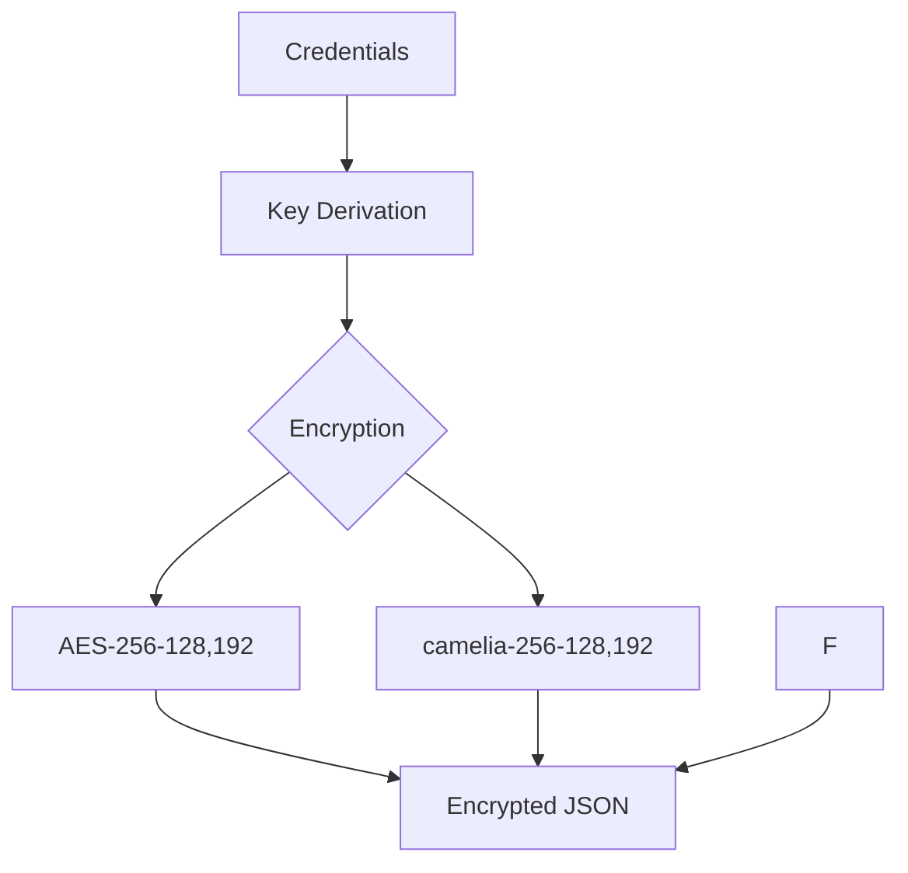

markdown
# Locker - Secure CLI Password Manager 🔒


A security-focused command-line password manager with multiple encryption schemes and secure memory handling.

## Features 
- **6 Encryption Schemes** with credential-derived keys
- Secure memory zeroization 
- JSON data handling with libjson
- OpenSSL-powered cryptography (libssl)
- CLI-only operation 
- Backup/restore functionality
- Secure password generator

## Installation ⚙️
```bash
git clone https://github.com/yourusername/Locker.git
cd Locker
sudo apt-get install libssl-dev libjson-c-dev  # Debian/Ubuntu
make
```

## Usage 

```bash
# Initialize new user
./Locker -i
```

# Add account (interactive):
```bash
./Locker -u <user> -P <pass> -n
```
# List accounts:
```bash
./Locker -u <user> -P <pass> -d
```
# Generate password:
```bash
./Locker -u <user> -P <pass> -r 16
```
# Delete account #2:
```bash
./Locker -u <user> -P <pass> -D 2
```
# Create backup:
```bash
./Locker -u <user> -P <pass> -b
```
# Restore backup:
```bash
./Locker -u <user> -P <pass> -R
```

## Command Reference 📖
| Option | Action                  | Arguments       |
|--------|-------------------------|-----------------|
| `-i`   | Initialize user         | None            |
| `-u`   | Username                | Required        |
| `-P`   | Master password         | Required        |
| `-n`   | Add account             | None            |
| `-d`   | List accounts           | None            |
| `-D`   | Delete account          | Account number  |
| `-b`   | Create backup           | None            |
| `-R`   | Restore backup          | None            |
| `-r`   | Generate password       | Length          |

## Security 


## Development Status 
```plaintext
███████████████████████░░ 85%
```

- Core functionality complete
- Memory security implemented
- Testing ongoing
- Crypto audit pending

⚠️ **Warning**: Not production-ready! Use only with test credentials.

## Contributing 
1. Fork repository
2. Create feature branch
3. Submit PR with description
4. Follow secure coding guidelines

## License 📄
MIT License - See [LICENSE](LICENSE) for details

